# Abhishek Jain — Project Portfolio

### Senior Full-Stack Developer | 10+ Years of Experience

I build scalable, production-ready web applications for businesses across healthcare, finance, field services, motorsport, and iGaming. Below are some of my recent projects built with modern tech stacks.

---

## What I Can Build For You

| Service | Description |
|---------|-------------|
| Custom Admin Dashboards & CRM Systems | Tailored business tools with role-based access and real-time data |
| SaaS Platforms with Multi-Tenant Architecture | Scalable apps serving multiple organizations with data isolation |
| Healthcare & Finance Management Systems | HIPAA-aware, secure platforms for sensitive industries |
| Mobile Apps + Web Apps | Cross-platform solutions using React Native + Next.js |
| AI-Powered Features | Chatbots, smart search, and AI integrations using Claude/OpenAI APIs |
| Large-Scale Data Management Platforms | High-volume CRUD apps with advanced filtering, reporting, and CSV operations |
| Legacy Modernization | Migrate PHP/WordPress apps to modern React/Next.js stacks |

---

## Projects

### 1. JJDH — Hospital Management System

> A comprehensive hospital/clinic admin dashboard for managing patients, doctors, appointments, prescriptions, invoices, and medical records.

🔗 **Live Demo:** [jjdh.vercel.app](https://jjdh.vercel.app/)

**Key Features:**
- Patient management with medical records, visit history, and medical image storage
- Doctor and staff management with role-based access (Super Admin, Admin, Doctor, Receptionist, Nurse)
- Appointment scheduling, prescription tracking, and medicine database
- Invoice generation and financial records
- Master data management (diagnoses, investigations, advice, medicines)
- Spreadsheet export for reporting

**Tech Stack:**


<details>
<summary><strong>Architecture</strong></summary>

```
Frontend:    Next.js 16 (App Router) with Server-Side Rendering
Backend:     Next.js API Routes with JWT Authentication
Database:    MongoDB Atlas with Mongoose ODM (embedded subdocuments)
Auth:        NextAuth v4 with credentials/JWT (5 user roles)
UI:          Tailwind CSS + shadcn/ui (Radix UI components)
Deployment:  Vercel with CI/CD
```
</details>

<details>
<summary><strong>Screenshots (click to expand)</strong></summary>
<br>

#### Secure Login — Role-based authentication for authorized hospital personnel


#### Dashboard — Real-time overview of patients, appointments, and hospital activity


#### Patient Management — Comprehensive list with search, filters, and quick actions


#### Patient Detail — Complete medical history, visit records, and documents


#### Appointments — Scheduling and calendar view for doctor-patient appointments


#### Invoice Generation — Create and manage billing with itemized details


</details>

---

### 2. LoanEase — Commercial Loan Referral Platform

> A multi-tenant loan referral management platform connecting referrers with commercial loan opportunities. Includes a web dashboard and a React Native mobile app.

🔗 **Live Demo:** [loanease-app.vercel.app](https://loanease-app.vercel.app/)

**Key Features:**
- Dual-access portals: Admin dashboard and Referrer dashboard
- Loan opportunity and application workflow management
- ABN/ABR validation for Australian business verification
- 2FA authentication, audit logging, and IP tracking
- Email notifications via Postmark
- Rich text editing for notes and communications
- PDF document generation for reports
- React Native mobile app (iOS & Android) for on-the-go access

**Tech Stack:**


<details>
<summary><strong>Architecture</strong></summary>

```
Frontend:    Next.js 15 (App Router) + React Native (Expo SDK 51)
Backend:     Next.js API Routes with JWT + bcrypt Authentication
Database:    MongoDB with Mongoose ODM
Services:    Postmark (email), Mapbox (location), ABN/ABR (verification)
Auth:        2FA + JWT with audit logging and IP tracking
Validation:  React Hook Form + Zod
Documents:   jsPDF + React PDF for report generation
Deployment:  Vercel (web) + Expo (mobile)
```
</details>

<details>
<summary><strong>Screenshots (click to expand)</strong></summary>
<br>

#### Login — Secure authentication with session management


#### Admin Dashboard — Overview of loan applications, referrers, and pipeline status


#### Applications — Track and manage commercial loan applications


#### Application Detail — Full application view with status, documents, and history


#### Referrer Dashboard — Dedicated portal for referrers to manage their pipeline


</details>

---

### 3. Total Spray Care (TSC) — Field Service Management

> An admin dashboard for spray booth maintenance and pest/spray care businesses to manage clients, sites, equipment, job cards, support tickets, and technicians.

🔗 **Live Demo:** [total-spray.vercel.app](https://total-spray.vercel.app/)

**Key Features:**
- Client and site management with multi-level organization
- Job card creation with technician assignment, checklists, and time tracking
- Equipment tracking with maintenance history, QR codes, and inspection checklists
- Support ticket system with activity logging
- Role-based access control across 5 user roles (Super Admin, Admin, Manager, Client User, Client Admin)
- Interactive charts and data visualization with Recharts
- PDF export and QR code generation for equipment

**Tech Stack:**


<details>
<summary><strong>Architecture</strong></summary>

```
Frontend:    Next.js 16 (App Router) with Server Components
Backend:     Next.js API Routes with NextAuth 5 (JWT + credentials)
Database:    MongoDB Atlas with Mongoose 9 ODM (59 models)
Auth:        NextAuth 5 beta with 5 role-based access levels
UI:          Tailwind CSS 4 + Radix UI (shadcn) + Recharts
Utilities:   jsPDF (export), QRCode (equipment tags), crypto-js
Deployment:  Vercel with CI/CD
```
</details>

<details>
<summary><strong>Screenshots (click to expand)</strong></summary>
<br>

#### Login — Secure access for admins, managers, and client users


#### Dashboard — Business overview with charts, job stats, and activity feed


#### Client Detail — Complete client profile with sites, contacts, and history


#### Job Cards — Manage work orders with status tracking and technician assignment


#### Job Card Detail — Full job view with checklists, time logs, and activity


#### Checklist Templates — Reusable inspection templates for field operations


#### Support Tickets — Track and resolve client issues with priority management


#### Ticket Detail — Full ticket view with conversation thread and status updates


</details>

---

### 4. Clue Finance — Loan Management Platform

> A multi-tenant commercial loan referral platform with comprehensive security, workflow management, and business verification capabilities.

🔗 **Live Demo:** [cluefinance.vercel.app](https://cluefinance.vercel.app/)

**Key Features:**
- Multi-tenant architecture with row-level security (RLS) for data isolation
- Loan opportunity and application processing workflows
- ABN/ABR business validation integration
- 2FA authentication for admin users
- Audit trails with IP monitoring
- Email notifications via Postmark
- Location search integration with Mapbox
- Rich text editing and PDF document generation
- Content Security Policy headers and XSS protection

**Tech Stack:**


-3FCF8E?style=flat-square&logo=supabase&logoColor=white)


<details>
<summary><strong>Architecture</strong></summary>

```
Frontend:    Next.js 15 (App Router) with Server-Side Rendering
Backend:     Next.js API Routes with middleware authentication
Database:    Supabase (PostgreSQL) with Row-Level Security & migrations
Auth:        2FA for admin users + JWT with audit trails
Services:    Postmark (email), Mapbox (location), ABN/ABR (verification)
Security:    CSP headers, XSS protection, IP monitoring, audit logging
Editor:      TipTap for rich text + jsPDF for document generation
Deployment:  Vercel with GitLab CI/CD pipeline
```
</details>

<details>
<summary><strong>Screenshots (click to expand)</strong></summary>
<br>

#### Dashboard — Loan pipeline overview with key metrics and activity


#### Clients — Manage organizations with multi-tenant data isolation


#### Client Detail — Full client profile with loan history and documents


#### Opportunities — Track and manage loan opportunities through the pipeline


#### Potential Referrers — Manage and onboard new referral partners


</details>

---

### 5. Karting NSW — State Karting Association Management System

> A comprehensive admin platform for Karting New South Wales (Australia) to manage members, licences, events, clubs, penalties, classes, and officials across the state karting organization.

**Key Features:**
- Member management with 109+ members — full profiles with Contact Info, Medical, Licences, Memberships, Penalties, Endorsements, Notes, Payments, Events, and Officials History tabs
- Proof of Identity and Driving Test verification workflow with Approve/Reject actions
- Licence management with pending licence review and approval system
- Event management — Karting Official Events with Entrants, Endorsements, Penalties, Products, Event Details, and Reports & Forms tabs
- Class Management across Club Level, State Level, and National Level — with Class Name, Licence Type, Min Grade, Min Age, and Engine configuration
- Club management with Membership Products (Fixed Date / Rolling types), Club Info, Events, Club Admins, and Sister Clubs
- Reports & Forms — Payments Report CSV, Race Entries Report, Endorsement Report, Penalties Report, Officials Reports (PDF), D Grade Scrutineers Report, Product Purchases
- Penalty forms — Judge of Fact Penalty, Nose Cone Position Form, Minor Ineligibility Notification, Infringement Form
- Event Officials and Engine Types configuration
- Communications module, Notes system, and Admin management
- Global Settings, Action Log for audit trail

**Tech Stack:**


<details>
<summary><strong>Architecture</strong></summary>

```
Frontend:    CakePHP Views + jQuery + Bootstrap + Custom CSS
Backend:     CakePHP MVC Framework (PHP)
Database:    MySQL with relational schema for members, licences, events, clubs
Auth:        State Admin role-based access with multi-level permissions
Features:    Member lifecycle, licence approval workflows, event management
Reporting:   CSV/PDF report generation for payments, entries, penalties, endorsements
```
</details>

<details>
<summary><strong>Screenshots (click to expand)</strong></summary>
<br>

#### Dashboard — State admin overview with Members, Officials, Pending Licences, and Proof of Identity review queue
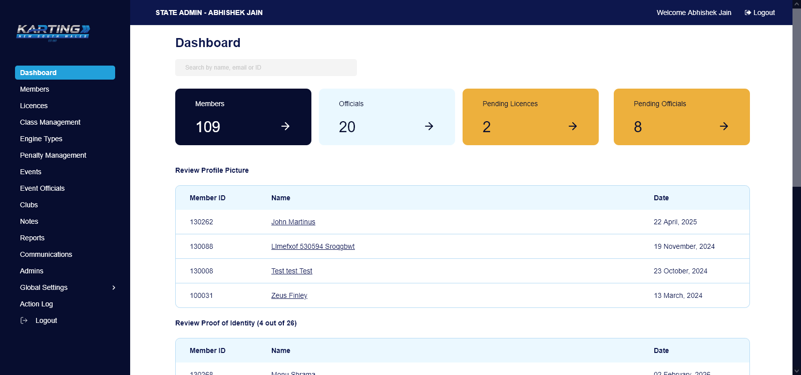

#### Members — Full member directory with ID, Name, Email, Mobile, and Active status
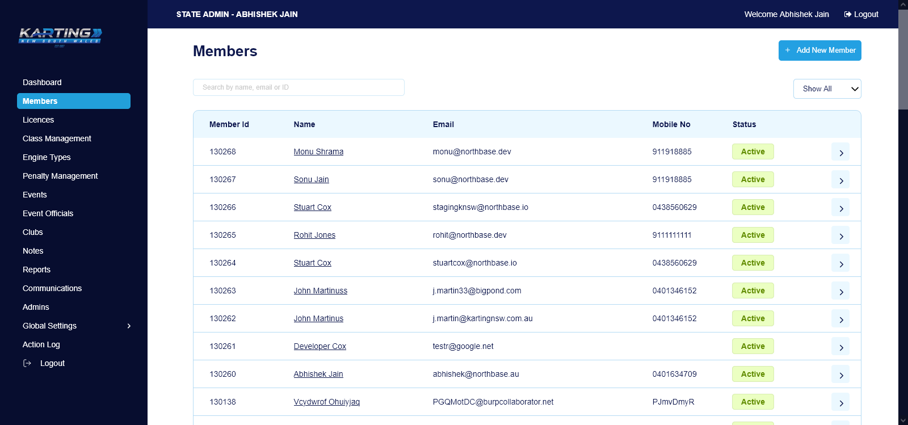

#### Member Detail — Complete profile with 10-tab navigation: Contact, Medical, Licences, Memberships, Penalties, Endorsements, Notes, Payments, Events, Officials History
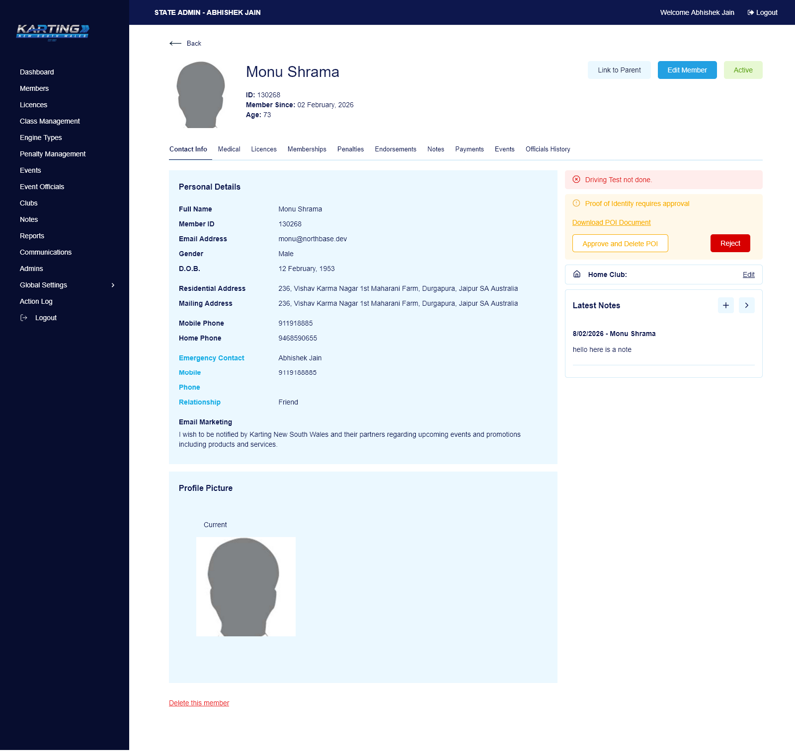

#### Karting Event — Official event management with Entrants, Endorsements, Penalties, Products, and Reports tabs
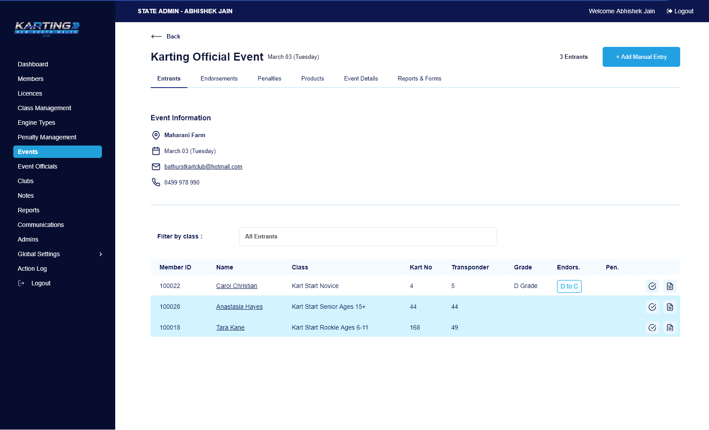

#### Class Management — Configure racing classes at Club, State, and National levels with licence types and engine rules
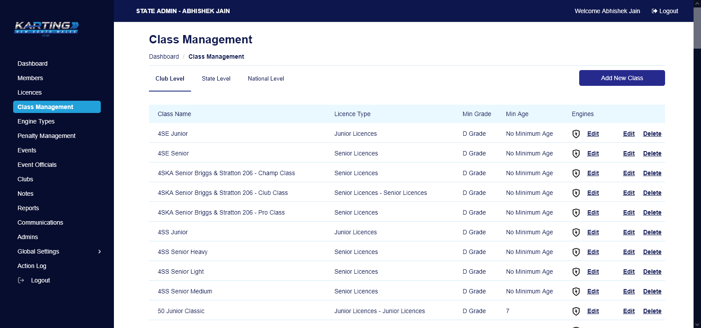

#### Club Memberships — Club detail with membership products, pricing (Fixed Date / Rolling types), and club administration
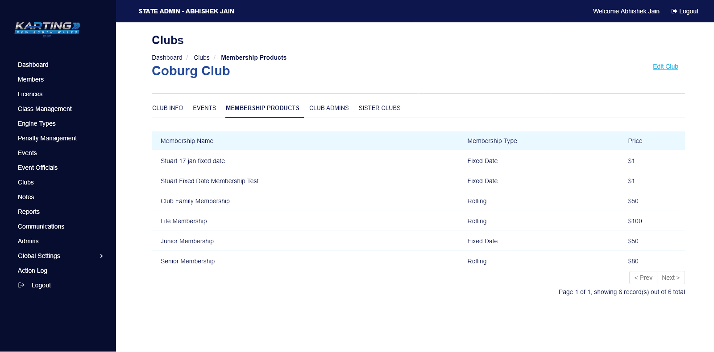

#### Reports & Forms — Event reports (CSV/PDF) and penalty forms for race officials
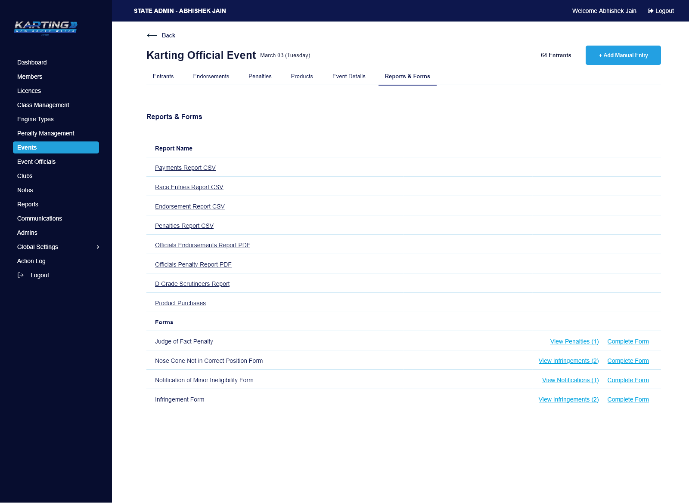

</details>

---

### 6. AASA — Australian Auto-Sport Alliance Management Platform

> A full-featured admin platform for the Australian Auto-Sport Alliance (AASA) — the national governing body for auto-sport. Manages licences, permits, vehicle passports, karting clubs, officials, media credentials, events, and coupons across the organization.

**Key Features:**
- Dashboard with monthly KPIs — Licences, Officials & Media applications with revenue tracking, Vehicle Passports, Renewals due, Media Licences, and National Race Licence review alerts
- Licence management — General Speed Licence, National Race Licences with search, status tracking (Active/Expired), PDF download, and View actions
- Detailed licence profiles — Personal Details, Emergency Contact, Licence/Venue Details, Medical Information (10+ health questions), Disclaimers & Payment (Stripe integration), Document uploads, and Historical Applications
- Public licence application form — Multi-section form with Licence Venue Details, Medical Information, Disclaimers & Payment, Refund Policy, Coupon system, and Stripe credit card payment ($101.08 fee)
- Permit management — Permit Info, Financials, Post Event, Documents, and Notes tabs with status workflow (Pending/Approved), Coversheet download, and Post Event Docs reminders
- Karting Clubs management — Club listing with Prefix, Member count, and View Members drill-down with licence details (Licence No, Type, Status, Expiry Date)
- Clubs/Promoters, Contacts, and Officials modules
- Driver Training Licence and Vehicle Passport management
- Media credentials management
- Upcoming Events and Coupons modules
- Reports, Admins, Global Settings, and Activity Log

**Tech Stack:**


<details>
<summary><strong>Architecture</strong></summary>

```
Frontend:    CakePHP Views + jQuery + Bootstrap + Custom CSS
Backend:     CakePHP MVC Framework (PHP)
Database:    MySQL with relational schema for licences, permits, clubs, events
Auth:        Admin role-based access with multi-module permissions
Payments:    Stripe integration for licence fees and coupon support
Features:    Licence lifecycle, permit workflow, medical compliance, document management
Reporting:   Reports module with activity logging
```
</details>

<details>
<summary><strong>Screenshots (click to expand)</strong></summary>
<br>

#### Login — AASA branded authentication with member and promoter registration options
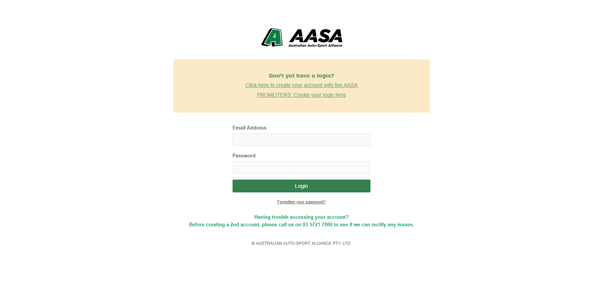

#### Admin Dashboard — Monthly KPIs for Licences, Officials & Media, Vehicle Passports, Renewals, and alert panels for Media and National Race Licences
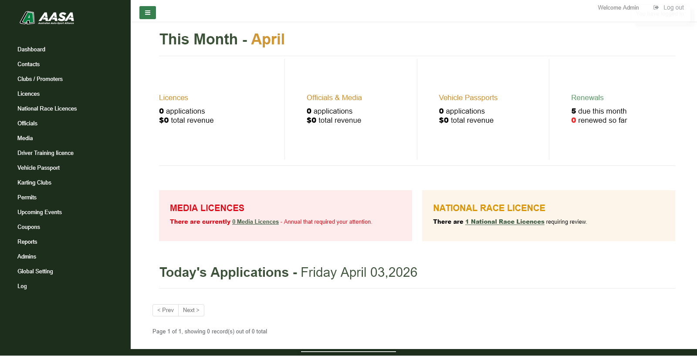

#### Karting Clubs — Club directory with Prefix, Member count, and View Members action
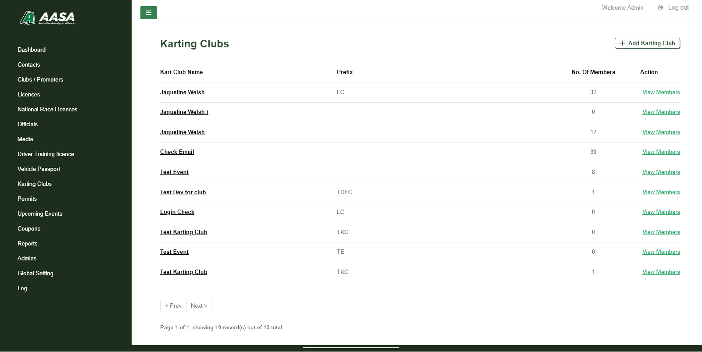

#### Club Members — Karting club member listing with Licence No, Mobile, Email, Expiry Date, Type, Status, and quick actions (View, Download, PDF)
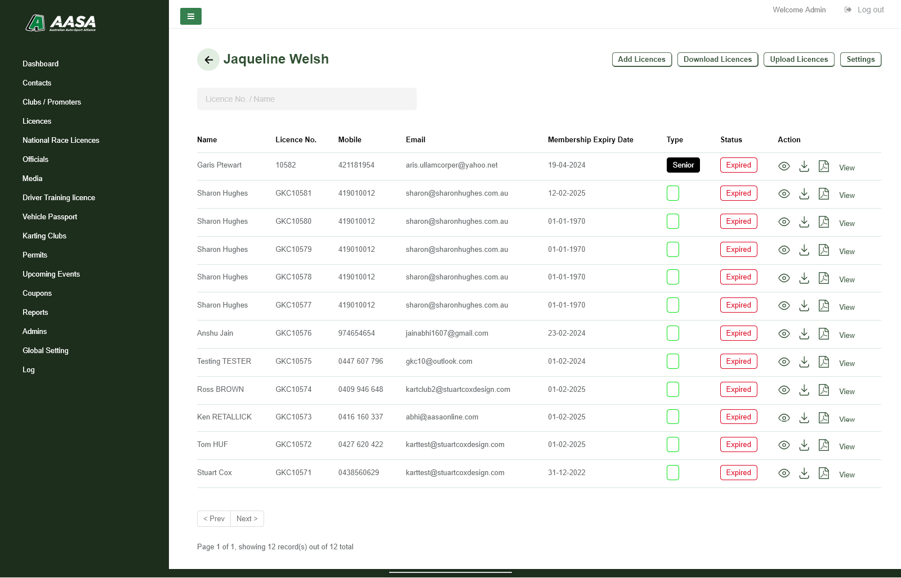

#### Licences — General Speed Licence management with search, status filters, and Add/Settings actions
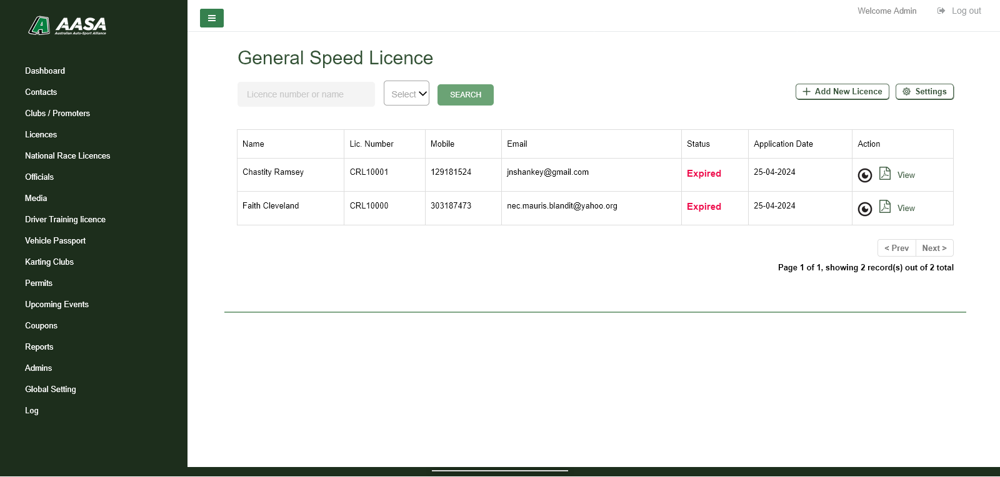

#### Licence Detail — Complete licence profile with Personal Details, Emergency Contact, Licence/Venue Details, Medical Information, Disclaimers & Payment, Document uploads, and Historical Applications
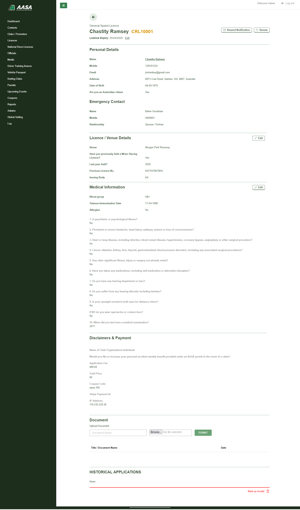

#### Licence Application — Public-facing multi-section application form with Medical Information, Disclaimers, Refund Policy, Coupon system, and Stripe payment integration
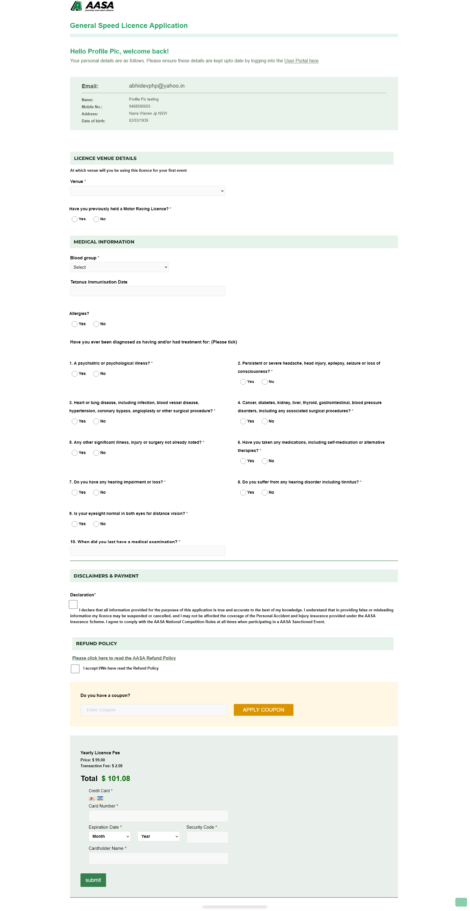

#### Permit Management — Permit detail with tabs for Permit Info, Financials, Post Event, Documents, and Notes — includes Coversheet download and status workflow
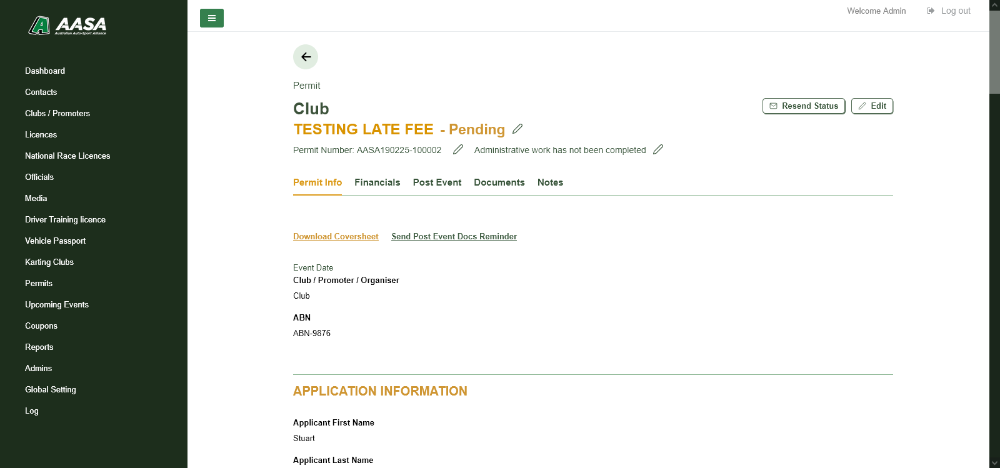

</details>

---

### 7. Link Management — Gambling Site Data Management Platform

> A large-scale CakePHP web application for managing data of gambling sites — Casino, Poker, Bingo, and Sports. Handles huge volumes of data with powerful reporting and advanced filtration options across 40+ modules.

**Key Features:**
- Site management with 20+ advanced filters (Domain, Availability, Theme, Article Duration, Price Ranges, Language, SEO metrics TF/CF/DA, Date Ranges, Gambling Site Type, Target Market, Operator, and more)
- Deal tracking with full lifecycle management — 650+ deals with Client, Company, Deal Amount, Deal Status, Deal Type, Deal Next Action, Link Writer, and Payment tracking
- Employee email outreach management with filters by Operator, Error Type, Domain, Date, Status, Language, TLD — with CSV upload/download
- Gambling site categorization: Casino, Poker, Bingo, and Sports betting
- CSV import/export across modules — Deal CSV Upload, Price Calculate CSV Upload, Download as CSV
- Client management — Client Sites, Client Current Price, Client Price Finder, Not Available For Client tracking
- Financial tools — Invoice Generator, Profit Margin calculator, Payment Price Calculator, Provider & Real Payment Status
- Data integrity tools — Root Domain Finder, Input Order Checker, Compare Files, Deal Correction
- 40+ configuration modules — Currency, Language, Multiple Keyword, Article Duration, Writing Price, Availability, Theme Site, Operator Type, Target Market, and more
- System administration — Download Backup, Settings, Admin Manager, Employee management

**Tech Stack:**


<details>
<summary><strong>Architecture</strong></summary>

```
Frontend:    CakePHP Views + jQuery + Bootstrap (responsive UI)
Backend:     CakePHP MVC Framework (PHP)
Database:    MySQL with complex relational schema
Features:    40+ sidebar modules, advanced search/filter on every listing
Data Ops:    CSV import/export, bulk operations, backup/restore
Reporting:   Multi-filter reporting across all modules
```
</details>

<details>
<summary><strong>Screenshots (click to expand)</strong></summary>
<br>

#### Sites — Manage gambling sites with 20+ advanced filter options
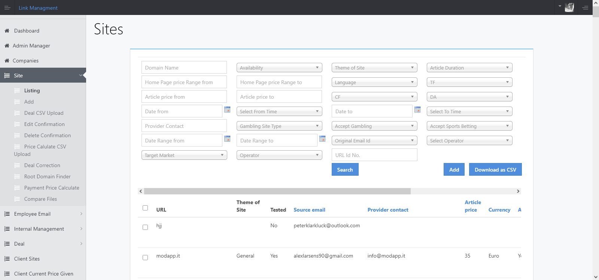

#### Deal Management — Track 650+ deals with full lifecycle and payment workflow
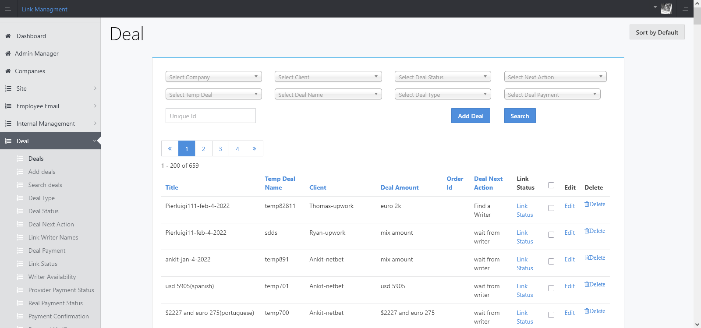

#### Add Deal — Comprehensive deal creation with client, company, and payment config
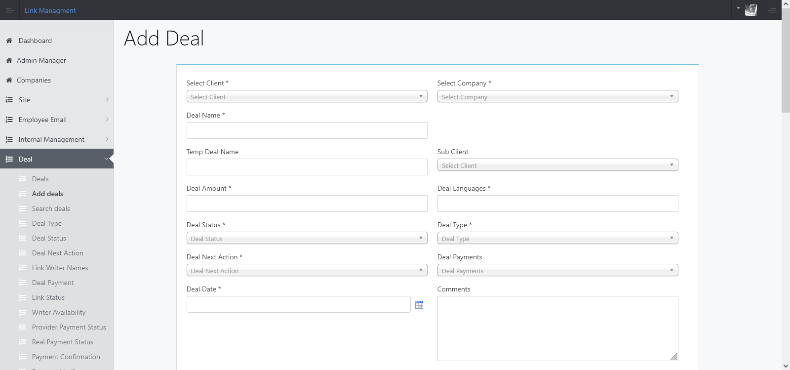

#### Add Site — Extensive site registration form with 30+ data fields including SEO metrics
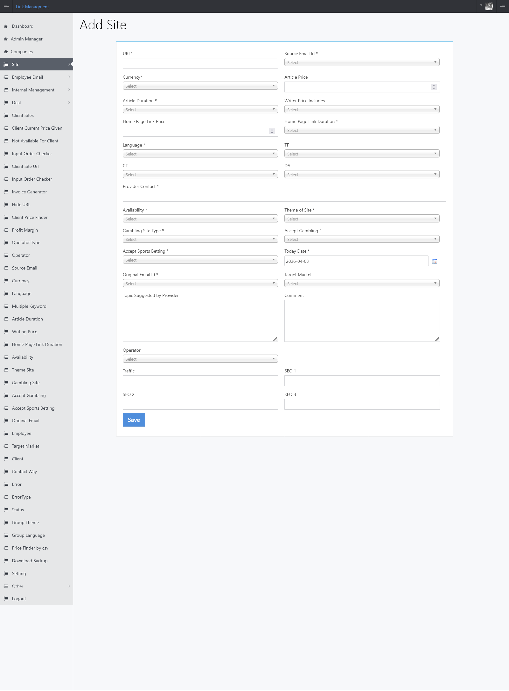

#### Gambling Site Types — Master configuration for Casino, Poker, Bingo, and Sports categories
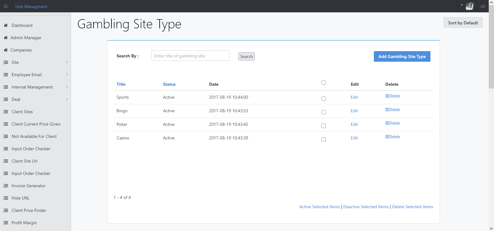

#### Employee Emails — Outreach tracking with advanced filters and CSV operations
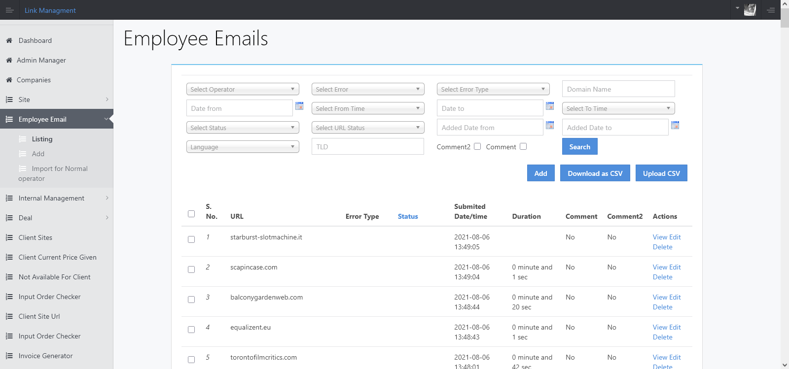

</details>

---

## Tech Stack Overview

### Frontend


### Backend & Database


### Cloud & DevOps


---

## About Me

I'm a Senior Full-Stack Developer with 10+ years of experience building web applications. I specialize in modern JavaScript/TypeScript ecosystems and CakePHP, and have delivered production-ready applications across healthcare, finance, field services, motorsport, and iGaming industries.

### What I Bring to Every Project
- End-to-end development from architecture to deployment
- Clean, maintainable, and scalable code
- Role-based access control and security best practices
- Responsive design that works across all devices
- Production deployment and performance optimization

---

## Let's Connect

[](https://linkedin.com/in/jn-abhi)
[](https://sterlinginfotech.com/portfolio)
[](mailto:info@sterlinginfotech.com)

---

> I'm available for **freelance projects**, **contract work**, and **full-time remote roles**. If you need an experienced full-stack developer, let's talk!
